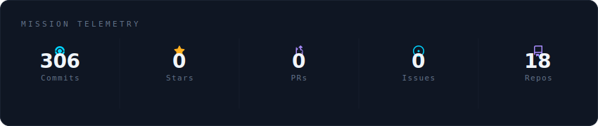

  

 

  

 

  

 

  

---

### 🌌 Обо мне

Привет! Я **willalone** — фронтенд-разработчик, который превращает идеи в живые интерфейсы. В моём коде всегда есть место для эстетики и чистоты.

- 🔭 Сейчас работаю над **React-приложениями** и изучаю **Next.js**
- 🌱 Осваиваю **GSAP** и сложные анимации
- 💬 Спрашивай про **TypeScript**, **CSS-фреймворки**, **Framer Motion**
- 📫 Связь: [telegram](https://t.me/your_nick) | [email](mailto:your.email@example.com)

---

  

